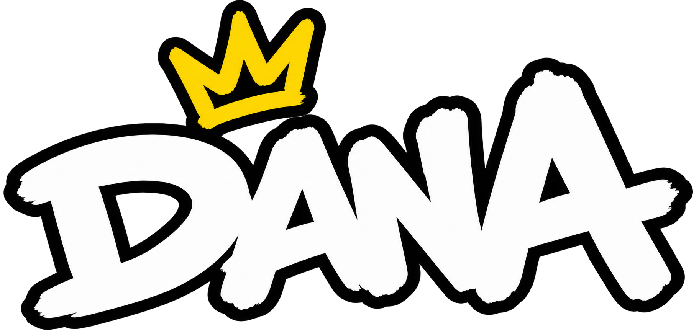

# DANA Coin — A Dose of Crypto Culture 👑

Official responsive web application for **DANA Coin ($DANA)** on BNB Chain.



## 🪙 Token Information
- **Token Name**: DANA Coin
- **Ticker**: $DANA
- **Network**: BNB Chain (BEP-20)
- **Contract Address**: `0x6C4e9893C3EA05594e5cf26E7B813a07a2B564B0`
- **DexScreener**: [DANA / WBNB on BSC](https://dexscreener.com/bsc/0xf471d46afdc6b29726d6e32e81b6ccc604f48129)

## 🌐 Community & Links
- **WhatsApp Channel**: [Solid Community - WhatsApp channel](https://www.whatsapp.com/channel/0029Vb8U9vT6hENyFyYDo61u)
- **WhatsApp Group**: [DANA Community](https://chat.whatsapp.com/Gpd3q6d02FwIkFM1FOCf7W)
- **X (Twitter)**: [@ardanadose](https://x.com/ardanadose)
- **Telegram**: [@SCF_Degens](https://t.me/SCF_Degens)

## 🚀 Features & Sections
- **Hero Section**: Floating 3D mascot, live BNB badge, quick CTAs to Buy $DANA and Join Community.
- **Vision Section**: "A Dose of Pure Fun" & "What is DANA?" interactive cards.
- **Culture Pillars**: Community, Memes, Creativity, and Participation showcase cards.
- **Tokenomics Section**: One-click contract address clipboard copy, BNB Chain network info, DEX shortcuts (PancakeSwap & DexScreener), and dynamic 3D Gold Coin visual.
- **Roadmap**: 4-phase milestone trajectory (Birth, Community, Growth, Global Dose).
- **CTA Section**: High-contrast gold community banner.
- **Footer**: Full navigation, brand links, and social chips.

## 🛠️ Development & Build

### Prerequisites
- [Flutter SDK](https://flutter.dev/docs/get-started/install) (3.x+)
- [Node.js](https://nodejs.org/) (optional, for local static server)

### Install Dependencies
```bash
flutter pub get
```

### Run Locally (Dev Mode)
```bash
flutter run -d chrome
```

### Build for Web (Production Release)
```bash
flutter build web --release
```

### Serve Web Build
```bash
node server.cjs 8080
```
Then open [http://localhost:8080/](http://localhost:8080/) in your browser.
